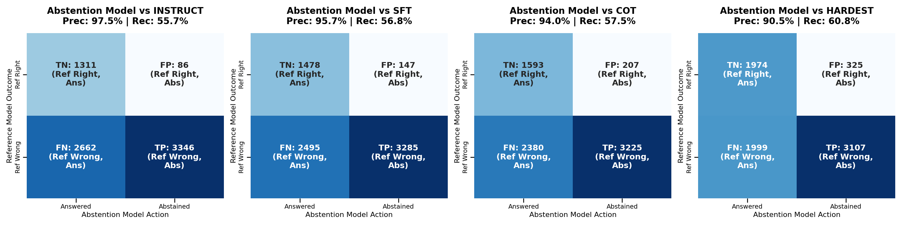
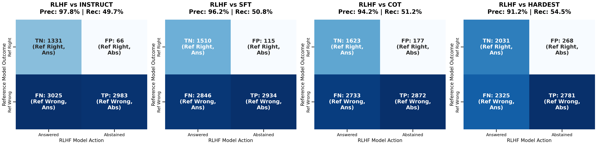
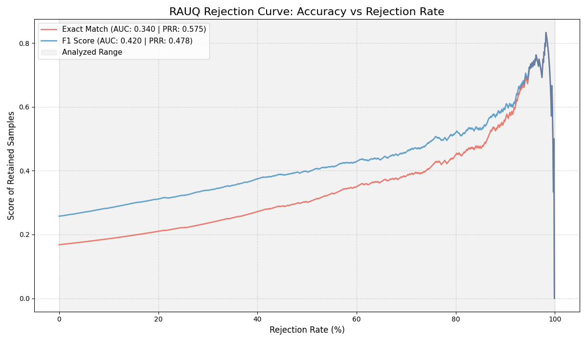

# Hallucination Mitigation in Closed-Book Question Answering

**Columbia COMS4705 Final Project**

**Authors:** Joshua Hegstad, Ahmed Jaber, Farhaan Siddiqui
**Mentor:** Melody Ma

## Abstract

Closed-book question answering (QA) systems must answer questions using only parametric knowledge, which makes them prone to **closed-book hallucination**: confident but factually incorrect answers with no supporting evidence. We view this behavior as arising from two failure modes:

1. **No Knowledge**: The model lacks the relevant knowledge
2. **Cannot Access Knowledge**: The knowledge is implicitly present in its parameters, but the model does not reliably retrieve or apply it at inference time

We study these failure modes on HotPotQA using Qwen2.5-Instruct-7B and propose a two-part mitigation pipeline combining Chain-of-Thought (CoT) distillation and abstention-aware fine-tuning with reinforcement learning.

## Key Results

- **CoT Distillation**: Improved Exact Match accuracy from 18.86% to 24.31% on HotPotQA
- **Abstention Precision**: Achieved 97.5% precision in detecting knowledge boundaries
- **RLVF**: Successfully tuned the risk-coverage trade-off, increasing answer rate by ~5% while maintaining safety
- **Semantic Entropy**: Validated as a robust proxy for correctness, enabling efficient rejection of hallucinations

## Approach

### 1. Chain-of-Thought (CoT) Distillation

To address the "cannot access knowledge" failure mode, we employ CoT distillation from a large teacher model (Qwen3-235B) to our smaller student model (Qwen2.5-7B).

**Key Innovation:** We constrain the teacher to generate "internalized knowledge" reasoning traces that frame answers as step-by-step recall of facts, explicitly forbidding citation markers. This ensures the student learns to function in a closed-book setting.

**Example:**
```
Q: Which magazine was started first Arthur's Magazine or First for Women?

R: Step 1: The question asks which magazine was started first between
   Arthur's Magazine and First for Women.
   Step 2: Arthur's Magazine was published starting in 1844, while First
   for Women was launched in the 1980s.
   Step 3: Since 1844 is earlier than the 1980s, Arthur's Magazine was
   started first.

A: Arthur's Magazine
```

### 2. Abstention-Aware Fine-Tuning

To mitigate the "no knowledge" failure mode, we teach the model to explicitly output "I don't know" when it lacks internal knowledge.

**Process:**
1. Map the knowledge boundary by running inference on 40,000 HotPotQA training examples
2. Partition data into:
   - **Correct Set**: Samples where the model's internal knowledge was sufficient
   - **Hallucination Set**: Samples where the model generated incorrect answers
3. Create Dataset C with 80% correct answers and 20% "I don't know" responses
4. Fine-tune using QLoRA to prevent "laziness" (defaulting to constant abstention)

### 3. Reinforcement Learning from Verifier Feedback (RLVF)

We refine abstention behavior using policy gradient RL with a multi-component reward function:

```
R(x, ŷ, y) = {
  +10.0  if EM(ŷ, y) = 1          (Correct Answer)
   -5.0  if ŷ ≠ y and ŷ ≠ "IDK"   (Hallucination)
   -1.0  if ŷ = "I don't know"     (Abstention Cost)
}
```

This creates a natural hierarchy: correct answers are strongly rewarded, hallucinations are heavily penalized, and abstentions incur a small penalty to prevent over-conservatism.

**Verifier Architecture:** We use an NLI-based factuality verifier that computes:
- p_entail: Probability that answer is entailed by question context
- p_contradict: Probability that answer contradicts known information
- Factuality score: f = p_entail - p_contradict

### 4. Uncertainty Quantification with Semantic Entropy

We implement Discrete Semantic Entropy (SE) to detect hallucinations at inference time:

1. Sample M=10 stochastic generations per question
2. Cluster them based on semantic equivalence using DeBERTa-large-MNLI
3. Compute cluster probabilities via Monte Carlo integration
4. Calculate entropy over semantic clusters: H(x) = -Σ P(C|x) log P(C|x)

High entropy indicates the model is uncertain and likely to hallucinate.

## Models

| Model | Description |
|-------|-------------|
| **Qwen2.5-Instruct** | Base Qwen2.5-7B-Instruct model |
| **Qwen2.5-SFT** | Fine-tuned on 10,000 Q&A pairs |
| **Qwen2.5-FCoT** | Fine-tuned on CoT reasoning traces from Qwen3-235B |
| **Qwen2.5-Abstain** | Fine-tuned on Q&A/abstention pairs (80/20 split) |
| **Qwen2.5-RLVF** | RLVF-trained model with verifier-based rewards |

## Performance Results

### Generation Performance

| Model | EM | F1 | Corrections | Regressions |
|-------|----|----|-------------|-------------|
| Qwen2.5-Instruct | 18.87% | 27.02% | - | - |
| Qwen2.5-SFT | 21.94% | 31.41% | 477 | 249 |
| **Qwen2.5-FCoT** | **24.31%** | **33.87%** | **697** | 294 |

### Abstention Performance

| Model | EM | F1 | Abs. Rate | Selective EM | Selective F1 |
|-------|----|----|-----------|--------------|--------------|
| Qwen2.5-Abstain | 20.37% | 26.04% | 46.34% | **37.98%** | **48.46%** |
| Qwen2.5-RLVF | 20.37% | 26.24% | **41.17%** | 34.62% | 44.60% |

**Key Insight:** The supervised abstention model achieves higher selective accuracy (37.98% vs 34.62%) but lower coverage (53.65% vs 58.83%). RLVF trades some selective accuracy for increased answer rate.

### Abstention Precision & Recall

The supervised model (Qwen2.5-Abstain) achieves **97.49% precision** against the base model, meaning its abstentions are almost invariably justified. The RLVF model maintains high precision (97.84%) while increasing coverage.

### Abstention Confusion Matrices

**Supervised Fine-Tuning (SFT) Model:**


**RLHF Model:**


### Semantic Entropy Analysis

- **Correct answers**: Heavily clustered around SE ≈ 0 (low uncertainty)
- **Incorrect answers**: Median SE ≈ 0.9 (high uncertainty)
- **Rejection at 50%**: Consensus strategy achieves Selective F1 of 0.69 (up from 0.50 at 0% rejection)

### RAUQ Rejection Curves

**Vanilla Qwen2.5-7B:**


**Fine-tuned Model:**


## Dataset

We use the **HotPotQA distractor dataset** in a strictly closed-book setting (all context paragraphs removed).

### Training Datasets

- **Dataset A**: 10,000 Q&A pairs from HotPotQA (train split)
- **Dataset B**: 10,000 Q&A pairs with CoT reasoning traces generated by Qwen3-235B
- **Dataset C**: 10,000 Q&A/abstention pairs (80/20 split) based on model's knowledge boundary

## Training Configuration

### QLoRA Configuration
- **Rank**: r=16, α=32
- **Dropout**: 0.05
- **Target modules**: q_proj, k_proj, v_proj, o_proj, gate_proj, up_proj, down_proj
- **Quantization**: 4-bit NF4 with double quantization

### Optimization
- **Optimizer**: AdamW
- **Learning rate**: 2e-4 (SFT), 1e-5 (RLVF)
- **Scheduler**: Cosine with 3% warmup
- **Batch size**: Effective batch size of 16 (4 per device × 4 gradient accumulation)

### Inference
- **Decoding**: Greedy (deterministic)
- **Max tokens**: 50 (standard), 512 (CoT)
- **Precision**: bfloat16

## Installation & Usage

```bash
# Clone the repository
git clone https://github.com/Ajaberr/HallucinationMitigationHotpotQA.git
cd HallucinationMitigationHotpotQA

# Install dependencies
pip install -r requirements.txt

# Run evaluation
python eval.py --model qwen2.5-fcot --dataset hotpotqa

# Run with abstention
python eval.py --model qwen2.5-abstain --enable-abstention

# Run with RLVF
python eval.py --model qwen2.5-rlvf --enable-abstention
```

## Key Findings

### Successes

1. **CoT Distillation Works**: Outperformed standard SFT by correcting 697 baseline errors vs 477 for SFT
2. **Abstention is Learnable**: 97.5% precision in detecting knowledge boundaries
3. **Semantic Entropy is Reliable**: Strong correlation with correctness (median SE: 0 for correct, 0.9 for incorrect)
4. **RLVF Enables Trade-off Tuning**: Successfully balanced coverage vs safety

### Limitations

1. **CoT Introduces New Errors**: 294 regressions where base model was correct
   - Hallucination via reasoning (fabricating specific details)
   - Granularity mismatch (e.g., "film director" vs "director")
2. **RLVF Trade-off**: Higher coverage comes at cost of selective accuracy
3. **Computational Cost**: Semantic Entropy requires 10 generations per question

### Qualitative Examples

**Success Case (Base Wrong → CoT Correct):**
```
Q: Were Scott Derrickson and Ed Wood of the same nationality?
Gold: yes
Base Prediction: No ❌
CoT Prediction: yes ✓

CoT Reasoning:
Step 1: The question asks about the nationalities of Scott Derrickson
        and Ed Wood.
Step 2: Scott Derrickson is an American film director... while Ed Wood
        was an American filmmaker...
Step 3: Since both individuals were born and active in the United States...
        the answer is yes.
```

**RLVF vs SFT Abstention:**
```
Q: What government position was held by the woman who portrayed Corliss
   Archer in the film Kiss and Tell?

SFT Model: "I don't know" (conservative, safe)
RLVF Model: "First Lady" ❌ (attempted answer, hallucination)
Gold: "Chief of Protocol"

---

Q: What army did the namesake of the ship launched as the München in 1930
   fight in during the American Revolutionary War?

SFT Model: "I don't know" (over-conservative)
RLVF Model: "Continental Army" ✓ (productive risk-taking)
Gold: "Continental Army"
```

## Future Work

1. **Lightweight Uncertainty Filters**: Cascade RAUQ as a pre-filter for Semantic Entropy to reduce inference latency
2. **Open-Book Transfer**: Assess whether calibration gains transfer when discriminating between parametric knowledge and retrieved context
3. **Improved Reward Modeling**: Explore more sophisticated confidence modeling to distinguish informative risk-taking from unreliable guessing

## Citation

```bibtex
@article{hegstad2024hallucination,
  title={Hallucination Mitigation in Closed-Book Question Answering via Chain-of-Thought Distillation and Abstention-Aware Fine-Tuning},
  author={Hegstad, Joshua and Jaber, Ahmed and Siddiqui, Farhaan},
  journal={Columbia COMS4705 Final Project},
  year={2024}
}
```

## Team Contributions

- **Josh Hegstad**: Training and evaluation of Tinker models, analysis thereof
- **Farhaan Siddiqui**: Training and evaluation of fine-tuned models (SFT, FCoT, Abstention), dataset generation, reasoning trace analysis
- **Ahmed Jaber**: Implementation of Reward Learning (RLVF) training and evaluation pipeline, development of NLI-verifier and abstention classification, analysis of abstention behavior

## License

This project is for academic purposes as part of Columbia University's COMS4705 course.

## Acknowledgments

Special thanks to our mentor **Melody Ma** for guidance throughout this project.
